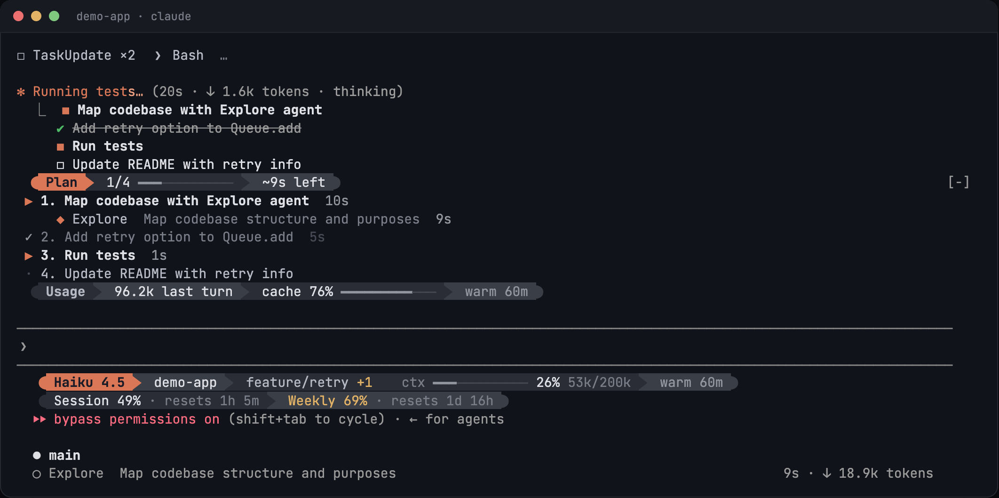

# ccshine

A plugin that makes the Claude Code terminal easier to follow. It shows what Claude is doing and what it costs, things the terminal normally keeps hidden, in one consistent colour theme.


<!-- TODO: capture docs/screenshot.png from a real session with a plan running -->

## What it adds

**Tasks band, above the prompt.** When Claude works through a task list, the band shows every task with what is done, what is running and how long each took. It also estimates the time left. The estimate learns from your past plans in each project, so it is ready before the first task finishes. Subagents appear under the task they work on, with a live timer and their tokens once finished.

```
 Plan  2/5 ━━━━╸─────── ~18m left
 ✓ 1. Schema migration  6m
 ▶ 2. Engine tests  4m 12s
     ◆ general-purpose  Running engine and orchestrator tests  2m 47s
 · 3. API routes
```

**Usage line.** Tokens used by the last turn (summed over every request in the turn, so cache reads count each time), how much of it the prompt cache covered, and how long until the cache goes cold. When a turn re-sent your context at full price because the cache had expired, it says so. When subagents ran, it splits the tokens by agent.

```
 Usage  101.2k last turn  cache 91% ━━━━━━━━━━╸─  warm 52m
 ⚠ cache was cold · this turn re-sent 41.0k at full price
```

**Compact tool rows.** Each tool call is one line with an icon, its target, `+added −removed` for edits and how long it took. Claude Code still draws the result (diffs, output) underneath. Folded runs of reads and searches become `◇ Read ×6  ⌕ Grep ×2`. MCP tools keep their usual look.

**Spinner that says what is happening.** `Editing queue.ts`, `Run the test suite`, `3 tools running` instead of a random word. Claude Code's own timer and token count stay.

**Turn receipt.** The `Baked for 1m 3s` line becomes a receipt: duration, a timeline of thinking versus tools, tokens and cache rate, and the three biggest parts of the turn.

```
1m 03s  ▇▇▇▇▇▇▇▇▇▇▇▒▒▒▒▒▒▒▒▒▒▒░░  101.2k tokens · cache 91%
Bash 31s · thinking 28s · Read ×6 4s
```

**Attention alerts.** A chime and a toast when a turn longer than 30 seconds finishes, and when Claude needs your permission or input.

## Install

From GitHub, inside Claude Code:

```
/plugin marketplace add <owner>/<repo>
/plugin install ccshine@ccshine
```

Or from a local folder:

```
claude --plugin-dir /path/to/ccshine
```

Requires **Claude Code 2.1.288 or later**. ccshine uses Claude Code's function-hooks plugin API, which is early access and may change between releases.

## Settings

Open `/config` and find the ccshine rows.

| Setting | Default | What it does |
|---|---|---|
| Theme | `claude` | Colour palette: `claude`, `nord`, `dracula`, `mono` |
| Powerline glyphs | off | Arrow and rounded-cap separators in headers. Needs a [Nerd Font](https://www.nerdfonts.com/) in your terminal |
| Tasks band | on | Tasks, time left and agents above the prompt |
| Tool rows | on | One-line tool calls |
| Spinner activity | on | Spinner says what is running |
| Turn receipt | on | Receipt under each turn |
| Usage line | on | Tokens, cache rate and cold-cache warnings above the prompt |
| Attention alerts | on | Chime and toast |
| Alert after (seconds) | `30` | Only alert for turns at least this long |
| Prompt cache lifetime | `1h` | `1h` on a Claude subscription, `5m` on an API key |

Every feature that is off leaves Claude Code's own display exactly as it was.

## Notes

- Chimes play through `afplay` on macOS. Linux and Windows terminals have no player, so alerts there are toasts only.
- The palettes are built for dark terminals.
- Usage covers the current session only. Account-wide plan limits are not visible to plugins.
- The permission-mode label (`bypass permissions on`) is drawn by Claude Code outside anything a plugin can restyle, so ccshine leaves it alone.

## Development

```
CLAUDE_CODE_TYPES=/path/to/claude-code.d.ts ./verify.sh
```

`verify.sh` validates the manifest, runs the tests with `claude plugin test` and type-checks with `tsc`. Once Claude Code has loaded the plugin, it writes the types into `.claude-plugin/types/` and `CLAUDE_CODE_TYPES` is no longer needed.

## Licence

MIT
